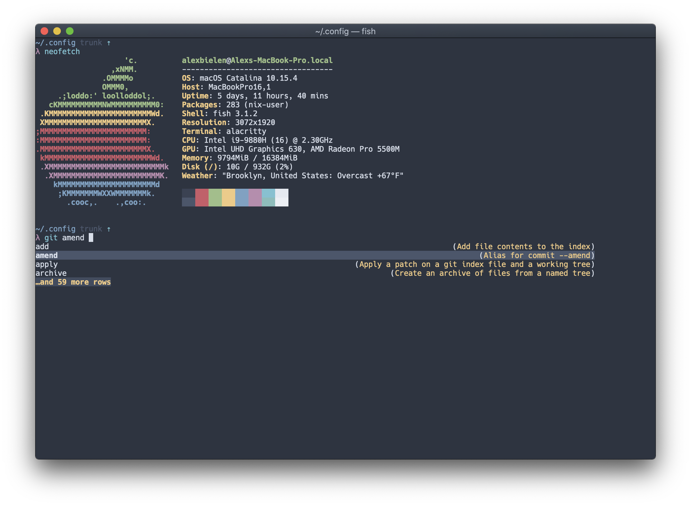

# Home 🏠

A reproducible, configurable, discoverable shell configuration.

# Goals

There are a few goals guiding this project: 

### Reproducible 

In the spirit of reproducibility, lean on [Nix Package Manager](https://nixos.org/) whenever possible. 

> Nix builds packages in isolation from each other. This ensures that they are reproducible and don't have undeclared dependencies, so if a package works on one machine, it will also work on another. 

All binary packagement is done through Nix. Packages are listed in the `nixpkgs/default.nix` file and can be installed or updated by running `nix-env -f default.nix -i`. It should be noted that individual tool's packages (for example fish shell's `fisher`)  are not generally managed by Nix. 

### Configurable

Choose tools that come with great defaults and powerful configuration options. Individual workflows are hard to generalize so allow customization. Ensure that configuration is easy to access ([XDG Base Directory Specification is a good idea!](https://wiki.archlinux.org/index.php/XDG_Base_Directory)) and change. Ensure that configuration is version-controlled.

### Discoverable 

A great feature is only great if users know it exists. In spirit of this, lean on `fish` shell's amazing `autocomplete` feature. Document this configuration throughly.

### Tested

Automate everything! All changes should go through automated testing.
