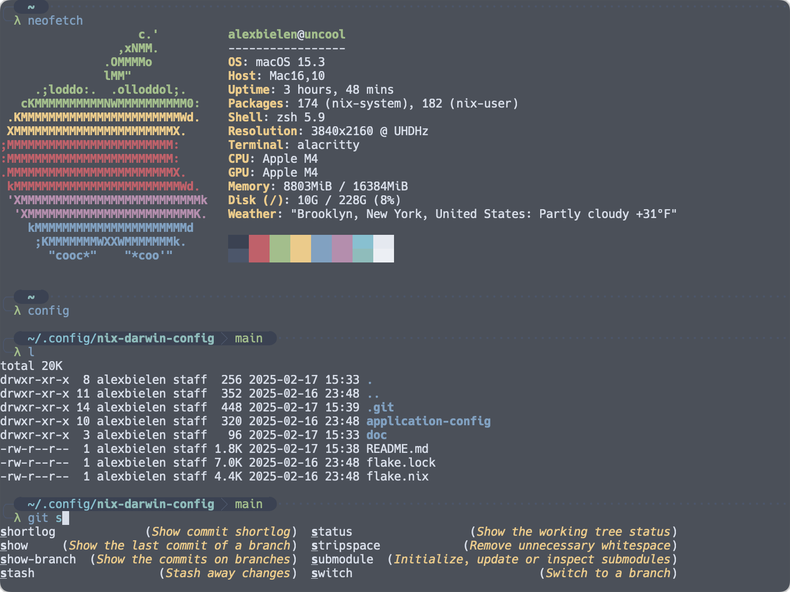

# Home 🏠




_"Home is where the configuration is..."_

Home is a Nix-based declarative system configuration for MacOS using `nix`, `nix-darwin`, and `home-manager`. 

The motiviation is to have as many things as possible about my setup configured declaratively in code. 

## Setup

These instructions assume you are installing on a new MacOS machine with Apple silicon. As of February 2025, I am running this on an Mac Mini with M4 chips.

### Install Nix

I used the [Determinate Nix GUI installer](https://docs.determinate.systems/getting-started/individuals/#install) to install nix. 

To test that `nix` is installed run the following: 

``` bash
> nix --version
nix (Nix) 2.24.12
```

### Get `git` and `xcode-select` tools

On a new Apple machine if you type `git` it might prompt you to automatically install `xcode-select` tools. 

Note that `git` is not optional here: Nix flakes requires that all files that are referenced in a flake be checked into source control. It is sufficient to `git add` the files that are referenced in the flake. 

### Setup `~/.config` directory

If `~/.config` doesn't exist then create it. 

Next, clone this repo into `~/.config` 

``` bash
> cd ~/.config 
> git clone https://github.com/alexbielen/home nix-darwin-config
```

Nix flakes 

### Run `nix-darwin` 

You'll first want to change to the `nix-darwin-config` directory which should look like this:

``` bash
.
├── README.md
├── application-config
├── flake.lock
└── flake.nix
```

In `flake.nix` you'll find a block that looks like the following:

```nix
    let
      user = "alexbielen";
      host = "Alexs-Mac-mini";
```

You can update these to whatever is relevant. To find the values in your current shell you can:

```bash
> echo $USER
> echo $HOST
```

Then run the following: 

```bash
> darwin-rebuild switch flake -- .
```

Note: it's possible you may have to run this ugly incantation instead if `nix-command` or `flakes` are not enabled:

```bash
> nix run nix-darwin --extra-experimental-features nix-command --extra-experimental-features flakes -- switch --flake .
```

The first run of this should take some time.


### Useful things I've read about Nix world

I've used `nix` in various formats for about 5 years now but this was my first deep dive into flakes. I also spent a little more time learning about language features that I vaguely knew about before. This also proved to be useful. I'm collecting resources below that I liked/want to return to/want to share with others that are interested in Nix. 

#### Flakes

[Flakes aren't real and cannot hurt you](https://jade.fyi/blog/flakes-arent-real/)

[Some notes on Nix flakes (Julia Evans)](https://jvns.ca/blog/2023/11/11/notes-on-nix-flakes/)


#### Setup tutorials (nix-darwin, home-manager)

[Package management on macOS with nix-darwin](https://davi.sh/blog/2024/01/nix-darwin/)

[Managing dotfiles on macOS with Nix](https://davi.sh/blog/2024/02/nix-home-manager/)

[Configuring VSCode with Nix on macOS](https://davi.sh/blog/2024/11/nix-vscode/)

[Setting up Nix on MacOS](https://nixcademy.com/posts/nix-on-macos/)

#### Haven't read but should 

[NixOS and Flakes Book](https://nixos-and-flakes.thiscute.world)

[How to Learn Nix -- _"a diary of every command I tried, every wrong assumption that I made, and every realization that I had along the way"_](https://ianthehenry.com/posts/how-to-learn-nix/)
